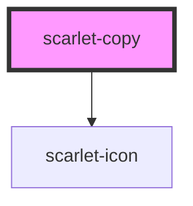

# scarlet-copy

<!-- Auto Generated Below -->

## Overview

A small icon button that copies `value` to the clipboard on click,
showing a brief "Copiado!" (or error) bubble and swapping its icon to a
checkmark before reverting automatically.

Uses the async Clipboard API (`navigator.clipboard.writeText`) when
available, falling back to a hidden `<textarea>` + `document.execCommand`
for non-secure contexts (plain HTTP, some older browsers) where the
Clipboard API doesn't exist at all.

`scarletCopy`/`scarletCopyError` fire on the outcome either way — listen
there instead of the visual feedback alone if the app needs to react to
a failed copy (e.g. logging it).

## Properties

| Property      | Attribute      | Description                                                                                | Type                                   | Default                     |
| ------------- | -------------- | ------------------------------------------------------------------------------------------ | -------------------------------------- | --------------------------- |
| `copiedLabel` | `copied-label` | Label (both visible bubble text and accessible label) shown right after a successful copy. | `"Copiado!"`                           | `'Copiado!'`                |
| `disabled`    | `disabled`     | Disables the button.                                                                       | `boolean`                              | `false`                     |
| `errorLabel`  | `error-label`  | Label (both visible bubble text and accessible label) shown after a failed copy.           | `"Não foi possível copiar"`            | `'Não foi possível copiar'` |
| `label`       | `label`        | Accessible label for the button in its resting state.                                      | `"Copiar"`                             | `'Copiar'`                  |
| `resetAfter`  | `reset-after`  | How long the copied/error state stays before reverting to idle, in milliseconds.           | `2000`                                 | `2000`                      |
| `size`        | `size`         | Size of the button.                                                                        | `"lg" \| "md" \| "sm" \| "xl" \| "xs"` | `'md'`                      |
| `value`       | `value`        | The text copied to the clipboard on click.                                                 | `""`                                   | `''`                        |

## Events

| Event              | Description                                                    | Type                  |
| ------------------ | -------------------------------------------------------------- | --------------------- |
| `scarletCopy`      | Emitted with the copied value after a successful copy.         | `CustomEvent<string>` |
| `scarletCopyError` | Emitted with the underlying error after a failed copy attempt. | `CustomEvent<Error>`  |

## Methods

### `copy() => Promise<void>`

Copies `value` to the clipboard, exactly as if the button had been clicked.

#### Returns

Type: `Promise<void>`

## Dependencies

### Depends on

- [scarlet-icon](../../foundation/scarlet-icon)

### Graph

----------------------------------------------

*Built with [StencilJS](https://stenciljs.com/)*
