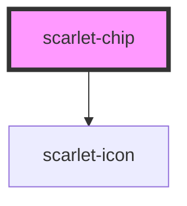

# scarlet-chip

<!-- Auto Generated Below -->

## Overview

A small, dismissible tag — for an active filter, a selected option, an
added item in a multi-value input. Not a `<scarlet-badge>` with a close
button bolted on: unlike a badge, this is meant to be interactive.

## Properties

| Property    | Attribute   | Description                                   | Type                                                                                   | Default     |
| ----------- | ----------- | --------------------------------------------- | -------------------------------------------------------------------------------------- | ----------- |
| `color`     | `color`     | Semantic color of the chip.                   | `"error" \| "info" \| "neutral" \| "primary" \| "secondary" \| "success" \| "warning"` | `'neutral'` |
| `disabled`  | `disabled`  | Disables the remove button and dims the chip. | `boolean`                                                                              | `false`     |
| `removable` | `removable` | Shows a remove ("x") button.                  | `boolean`                                                                              | `false`     |
| `variant`   | `variant`   | Visual style of the chip.                     | `"outline" \| "soft" \| "solid"`                                                       | `'soft'`    |

## Events

| Event           | Description                                                                                                             | Type                |
| --------------- | ----------------------------------------------------------------------------------------------------------------------- | ------------------- |
| `scarletRemove` | Emitted when the remove button is activated. The chip does not remove itself — the consumer owns the list it came from. | `CustomEvent<void>` |

## Slots

| Slot | Description       |
| ---- | ----------------- |
|      | The chip's label. |

## Dependencies

### Depends on

- [scarlet-icon](../../foundation/scarlet-icon)

### Graph

----------------------------------------------

*Built with [StencilJS](https://stenciljs.com/)*
