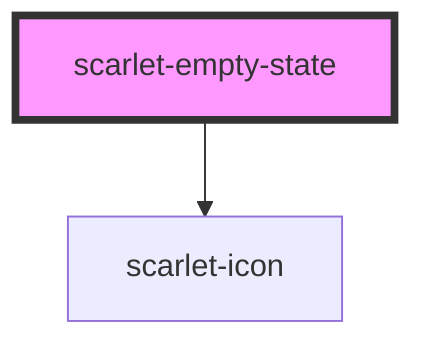

# scarlet-empty-state

<!-- Auto Generated Below -->

## Overview

A placeholder for a list, search result, or section with nothing to
show — an icon, a heading, an optional description, and an optional
action (e.g. "Limpar filtros" or "Criar o primeiro item").

## Properties

| Property      | Attribute     | Description                                                           | Type                                                                                                                                                                                                                                                                                                                                                                                                                                                                                                                                   | Default                          |
| ------------- | ------------- | --------------------------------------------------------------------- | -------------------------------------------------------------------------------------------------------------------------------------------------------------------------------------------------------------------------------------------------------------------------------------------------------------------------------------------------------------------------------------------------------------------------------------------------------------------------------------------------------------------------------------- | -------------------------------- |
| `description` | `description` | Supporting text below the heading.                                    | `string \| undefined`                                                                                                                                                                                                                                                                                                                                                                                                                                                                                                                  | `undefined`                      |
| `heading`     | `heading`     | Main heading.                                                         | `"Nenhum resultado encontrado."`                                                                                                                                                                                                                                                                                                                                                                                                                                                                                                       | `'Nenhum resultado encontrado.'` |
| `icon`        | `icon`        | Icon shown above the heading. Ignored if the `icon` slot has content. | `"alert-circle" \| "alert-triangle" \| "arrow-down" \| "arrow-left" \| "arrow-right" \| "arrow-up" \| "calendar" \| "check" \| "check-circle" \| "chevron-down" \| "chevron-left" \| "chevron-right" \| "chevron-up" \| "clock" \| "external-link" \| "eye" \| "eye-off" \| "file" \| "grip-vertical" \| "heart" \| "info-circle" \| "lock" \| "mail" \| "minus" \| "more-horizontal" \| "more-vertical" \| "pencil" \| "plus" \| "search" \| "settings" \| "star" \| "trash" \| "upload" \| "user" \| "x" \| "x-circle" \| undefined` | `undefined`                      |

## Slots

| Slot       | Description                                                  |
| ---------- | ------------------------------------------------------------ |
| `"action"` | A `scarlet-button` or similar call to action.                |
| `"icon"`   | Overrides `icon` with custom content (e.g. an illustration). |

## Dependencies

### Depends on

- [scarlet-icon](../../foundation/scarlet-icon)

### Graph

----------------------------------------------

*Built with [StencilJS](https://stenciljs.com/)*
