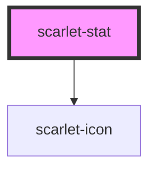

# scarlet-stat

<!-- Auto Generated Below -->

## Overview

A single labeled metric — a number/value, its label, and an optional
change indicator (e.g. "+12%" with an up/down arrow) for a dashboard.

## Properties

| Property | Attribute | Description                                                                     | Type                          | Default     |
| -------- | --------- | ------------------------------------------------------------------------------- | ----------------------------- | ----------- |
| `change` | `change`  | Change text, e.g. "+12% vs. mês anterior". Omit to hide the whole change row.   | `string \| undefined`         | `undefined` |
| `label`  | `label`   | Label above the value, e.g. "Receita total".                                    | `""`                          | `''`        |
| `trend`  | `trend`   | Direction the change indicates — colors and arrows the change text accordingly. | `"down" \| "neutral" \| "up"` | `'neutral'` |
| `value`  | `value`   | The metric itself, e.g. "R$ 42.900".                                            | `""`                          | `''`        |

## Dependencies

### Depends on

- [scarlet-icon](../../foundation/scarlet-icon)

### Graph

----------------------------------------------

*Built with [StencilJS](https://stenciljs.com/)*
