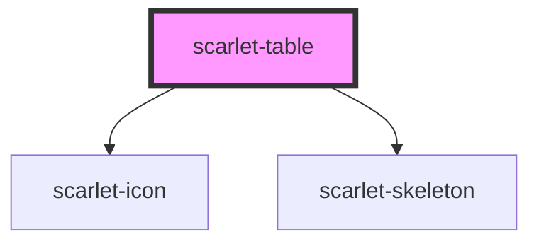

# scarlet-table

<!-- Auto Generated Below -->

## Overview

A data table: sortable columns (including multi-column sort), optional
row selection (checkboxes), drag-and-drop column/row reordering, empty/
loading states, and a horizontally-scrolling wrapper so a wide table
never breaks the surrounding layout on a narrow viewport (same pattern
`scarlet-tabs` uses for its tab list).

Cell content is `String(row[column.key])` by default — good enough for
plain text/numbers, but there's no per-cell slot system (that needs a
stable id per row and gets complex fast). For anything richer — a
`scarlet-badge` status, a formatted currency, a truncated link — pass
`formatCell`, a plain function `(row, column) => string` set as a JS
property (like `columns`/`rows` themselves, it isn't parseable from an
HTML attribute).

Sorting is handled internally using a locale-aware comparator (numeric
for `number` values, `localeCompare` otherwise) — good for typical
text/number columns without any setup. `scarletSort` still fires on every
click if a consumer wants to replace that with their own comparator (e.g.
sorting a formatted date column by its real underlying timestamp) by
reassigning `rows` themselves in response. A plain click always sorts by
that column alone (toggling asc/desc); with `multiSort`, shift-clicking a
second sortable header adds it as a tiebreaker instead of replacing the
first, cycling asc → desc → removed on repeated shift-clicks.
`scarletSort` always emits the *complete* current sort, in priority
order — an empty array once every column is cleared.

`reorderableColumns`/`reorderableRows` add drag handles for reordering
columns and rows by dragging. Known limitation: native HTML5 drag-and-
drop isn't keyboard-accessible — there's no non-pointer way to reorder.
Row reordering is disabled while any sort is active, since the row order
would just be re-derived from the sort on the next render; clear the
sort first (or don't combine the two features) to drag rows freely.

## Properties

| Property             | Attribute             | Description                                                                                                                                                                     | Type                                                                          | Default                         |
| -------------------- | --------------------- | ------------------------------------------------------------------------------------------------------------------------------------------------------------------------------- | ----------------------------------------------------------------------------- | ------------------------------- |
| `ariaLabel`          | `aria-label`          | Accessible label for the table, when there is no visible heading nearby.                                                                                                        | `string \| undefined`                                                         | `undefined`                     |
| `clickableRows`      | `clickable-rows`      | Makes whole rows clickable (emits `scarletRowClick`), e.g. to open a detail view.                                                                                               | `boolean`                                                                     | `false`                         |
| `columns`            | --                    | Column definitions, in display order — unless `reorderableColumns` has been used to drag them into a different order since.                                                     | `ScarletTableColumn[]`                                                        | `[]`                            |
| `emptyMessage`       | `empty-message`       | Message shown instead of rows when `rows` is empty.                                                                                                                             | `"Nenhum registro encontrado."`                                               | `'Nenhum registro encontrado.'` |
| `formatCell`         | --                    | Optional per-cell formatter, overriding the default `String(row[column.key])`. Set as a JS property, not an HTML attribute.                                                     | `((row: ScarletTableRow, column: ScarletTableColumn) => string) \| undefined` | `undefined`                     |
| `loading`            | `loading`             | Shows placeholder skeleton rows instead of rows/empty state.                                                                                                                    | `boolean`                                                                     | `false`                         |
| `loadingMessage`     | `loading-message`     | Message shown alongside/instead of the skeleton rows while `loading` is true — kept for consumers that prefer plain text, or as the `aria-label` describing the skeleton state. | `"Carregando…"`                                                               | `'Carregando…'`                 |
| `loadingRowCount`    | `loading-row-count`   | Number of placeholder skeleton rows rendered while `loading` is true.                                                                                                           | `5`                                                                           | `5`                             |
| `maxHeight`          | `max-height`          | Caps the table's height and makes it scroll vertically (in addition to the horizontal scroll it already has). Any valid CSS length, e.g. `'320px'`.                             | `string \| undefined`                                                         | `undefined`                     |
| `multiSort`          | `multi-sort`          | Allows shift-clicking a second (third, ...) sortable header to sort by it as a tiebreaker, instead of replacing the current sort outright.                                      | `boolean`                                                                     | `false`                         |
| `reorderableColumns` | `reorderable-columns` | Shows a drag handle per column header for reordering columns by dragging.                                                                                                       | `boolean`                                                                     | `false`                         |
| `reorderableRows`    | `reorderable-rows`    | Shows a drag handle per row for reordering rows by dragging. Disabled while any column sort is active — see the class doc comment.                                              | `boolean`                                                                     | `false`                         |
| `rowKey`             | `row-key`             | Field on each row object holding its unique identifier — used for selection tracking.                                                                                           | `"id"`                                                                        | `'id'`                          |
| `rows`               | --                    | The data to render, one object per row.                                                                                                                                         | `ScarletTableRow[]`                                                           | `[]`                            |
| `selectable`         | `selectable`          | Shows a checkbox column and enables row selection.                                                                                                                              | `boolean`                                                                     | `false`                         |
| `selectedRowKeys`    | --                    | Keys (from `rowKey`) of the currently selected rows.                                                                                                                            | `(string \| number)[]`                                                        | `[]`                            |
| `stickyHeader`       | `sticky-header`       | Keeps the header row visible while the table's own body scrolls vertically — set `maxHeight` too, or there's nothing for it to stick against.                                   | `boolean`                                                                     | `false`                         |

## Events

| Event                    | Description                                                                                                                                                                                                                             | Type                                     |
| ------------------------ | --------------------------------------------------------------------------------------------------------------------------------------------------------------------------------------------------------------------------------------- | ---------------------------------------- |
| `scarletColumnReorder`   | Emitted with the columns in their new order after a drag-and-drop column reorder.                                                                                                                                                       | `CustomEvent<ScarletTableColumn[]>`      |
| `scarletRowClick`        | Emitted with the row's data when a row is clicked. Only fires when `clickableRows` is set.                                                                                                                                              | `CustomEvent<{ [x: string]: unknown; }>` |
| `scarletRowReorder`      | Emitted with `rows` in their new order after a drag-and-drop row reorder — `rows` itself is already updated to match by the time this fires.                                                                                            | `CustomEvent<ScarletTableRow[]>`         |
| `scarletSelectionChange` | Emitted with the full array of selected row keys whenever a row or the "select all" checkbox is toggled.                                                                                                                                | `CustomEvent<(string \| number)[]>`      |
| `scarletSort`            | Emitted with the complete current sort (in priority order; empty once cleared) whenever a sortable header is clicked. The table already re-sorts itself with a generic comparator — listen here only to replace that with custom logic. | `CustomEvent<ScarletTableSortChange[]>`  |

## Dependencies

### Depends on

- [scarlet-icon](../../foundation/scarlet-icon)
- [scarlet-skeleton](../../feedback/scarlet-skeleton)

### Graph

----------------------------------------------

*Built with [StencilJS](https://stenciljs.com/)*
