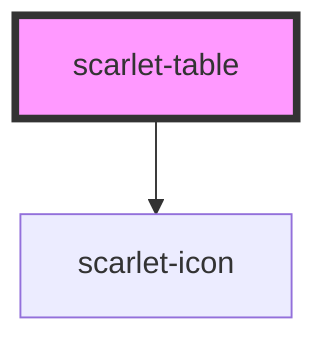

# scarlet-table

<!-- Auto Generated Below -->

## Overview

A data table: sortable columns, optional row selection (checkboxes),
empty/loading states, and a horizontally-scrolling wrapper so a wide
table never breaks the surrounding layout on a narrow viewport (same
pattern `scarlet-tabs` uses for its tab list).

Cell content is `String(row[column.key])` by default — good enough for
plain text/numbers, but there's no per-cell slot system (that needs a
stable id per row and gets complex fast). For anything richer — a
`scarlet-badge` status, a formatted currency, a truncated link — pass
`formatCell`, a plain function `(row, column) => string` set as a JS
property (like `columns`/`rows` themselves, it isn't parseable from an
HTML attribute).

Sorting is handled internally using a locale-aware comparator (numeric
for `number` values, `localeCompare` otherwise) — good for typical
text/number columns without any setup. `scarletSort` still fires on every
click if a consumer wants to replace that with their own comparator (e.g.
sorting a formatted date column by its real underlying timestamp) by
reassigning `rows` themselves in response.

## Properties

| Property          | Attribute         | Description                                                                                                                 | Type                                                                          | Default                         |
| ----------------- | ----------------- | --------------------------------------------------------------------------------------------------------------------------- | ----------------------------------------------------------------------------- | ------------------------------- |
| `ariaLabel`       | `aria-label`      | Accessible label for the table, when there is no visible heading nearby.                                                    | `string \| undefined`                                                         | `undefined`                     |
| `clickableRows`   | `clickable-rows`  | Makes whole rows clickable (emits `scarletRowClick`), e.g. to open a detail view.                                           | `boolean`                                                                     | `false`                         |
| `columns`         | --                | Column definitions, in display order.                                                                                       | `ScarletTableColumn[]`                                                        | `[]`                            |
| `emptyMessage`    | `empty-message`   | Message shown instead of rows when `rows` is empty.                                                                         | `"Nenhum registro encontrado."`                                               | `'Nenhum registro encontrado.'` |
| `formatCell`      | --                | Optional per-cell formatter, overriding the default `String(row[column.key])`. Set as a JS property, not an HTML attribute. | `((row: ScarletTableRow, column: ScarletTableColumn) => string) \| undefined` | `undefined`                     |
| `loading`         | `loading`         | Shows `loadingMessage` instead of rows/empty state.                                                                         | `boolean`                                                                     | `false`                         |
| `loadingMessage`  | `loading-message` | Message shown while `loading` is true.                                                                                      | `"Carregando…"`                                                               | `'Carregando…'`                 |
| `rowKey`          | `row-key`         | Field on each row object holding its unique identifier — used for selection tracking.                                       | `"id"`                                                                        | `'id'`                          |
| `rows`            | --                | The data to render, one object per row.                                                                                     | `ScarletTableRow[]`                                                           | `[]`                            |
| `selectable`      | `selectable`      | Shows a checkbox column and enables row selection.                                                                          | `boolean`                                                                     | `false`                         |
| `selectedRowKeys` | --                | Keys (from `rowKey`) of the currently selected rows.                                                                        | `(string \| number)[]`                                                        | `[]`                            |

## Events

| Event                    | Description                                                                                                                                                           | Type                                     |
| ------------------------ | --------------------------------------------------------------------------------------------------------------------------------------------------------------------- | ---------------------------------------- |
| `scarletRowClick`        | Emitted with the row's data when a row is clicked. Only fires when `clickableRows` is set.                                                                            | `CustomEvent<{ [x: string]: unknown; }>` |
| `scarletSelectionChange` | Emitted with the full array of selected row keys whenever a row or the "select all" checkbox is toggled.                                                              | `CustomEvent<(string \| number)[]>`      |
| `scarletSort`            | Emitted when a sortable column header is activated. The table already re-sorts itself with a generic comparator — listen here only to replace that with custom logic. | `CustomEvent<ScarletTableSortChange>`    |

## Dependencies

### Depends on

- [scarlet-icon](../../foundation/scarlet-icon)

### Graph

----------------------------------------------

*Built with [StencilJS](https://stenciljs.com/)*
