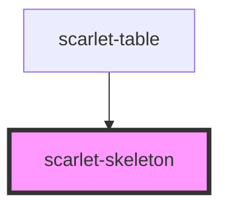

# scarlet-skeleton

<!-- Auto Generated Below -->

## Overview

A loading placeholder shape — swap it in for content that hasn't arrived
yet (a card, an avatar, a paragraph). Purely decorative (`aria-hidden`):
announcing the *loading* state itself (e.g. `aria-busy` on the section
being replaced) is the consumer's responsibility, not this component's.

## Properties

| Property  | Attribute | Description                                                                                                         | Type                           | Default     |
| --------- | --------- | ------------------------------------------------------------------------------------------------------------------- | ------------------------------ | ----------- |
| `height`  | `height`  | Any valid CSS height. Defaults to one text line's height for `text`, or `width`'s value for `circle`.               | `string \| undefined`          | `undefined` |
| `lines`   | `lines`   | Number of stacked lines, only for `variant="text"`. The last line renders narrower, like a paragraph's ragged edge. | `1`                            | `1`         |
| `variant` | `variant` | Shape of the placeholder.                                                                                           | `"circle" \| "rect" \| "text"` | `'text'`    |
| `width`   | `width`   | Any valid CSS width. Defaults to 100% for `text`/`rect`, or `height`'s value for `circle`.                          | `string \| undefined`          | `undefined` |

## Dependencies

### Used by

 - [scarlet-table](../../data-display/scarlet-table)

### Graph

----------------------------------------------

*Built with [StencilJS](https://stenciljs.com/)*
