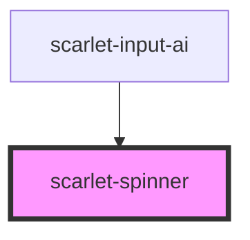

# scarlet-spinner

<!-- Auto Generated Below -->

## Overview

A loading indicator — `variant="circle"` for the generic spinner (the
same shape `scarlet-button`'s own `loading` state uses), `variant="logo"`
for the Scarlet mark itself pulsing, e.g. for a full-page loading state.
`role="status"` with `label` as its accessible name, so assistive tech
announces the loading state without needing separate visible text.

## Properties

| Property  | Attribute | Description                                                        | Type                                   | Default        |
| --------- | --------- | ------------------------------------------------------------------ | -------------------------------------- | -------------- |
| `label`   | `label`   | Accessible label, announced by assistive tech via `role="status"`. | `string`                               | `'Carregando'` |
| `size`    | `size`    | Size of the indicator.                                             | `"lg" \| "md" \| "sm" \| "xl" \| "xs"` | `'md'`         |
| `variant` | `variant` | Which loading indicator to show.                                   | `"circle" \| "logo"`                   | `'circle'`     |

## Dependencies

### Used by

 - [scarlet-input-ai](../../form/scarlet-input-ai)

### Graph

----------------------------------------------

*Built with [StencilJS](https://stenciljs.com/)*
