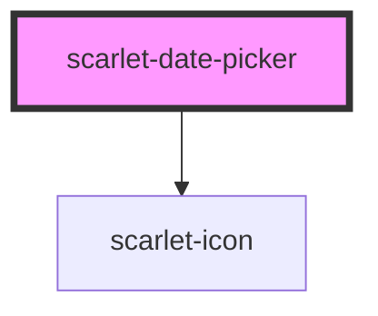

# scarlet-date-picker

<!-- Auto Generated Below -->

## Overview

A `DD/MM/AAAA` date input (typing, masking and calendar validation shared
with `scarlet-input-date`) plus a calendar popover for picking a date
visually — a button next to the field opens a month grid; arrow keys move
within it (Home/End jump to the start/end of the week, PageUp/PageDown
change month, Shift+PageUp/PageDown change year), Enter/Space picks the
focused day, Escape closes and returns focus to the toggle button.

Known limitations:
- The popover closes on Escape, on picking a day, or on clicking outside
  it — not on Tab-ing past its last focusable element. A keyboard user who
  tabs out instead of pressing Escape will move focus past the component
  with the panel still visually open.
- Like `scarlet-tooltip`, positioning is plain CSS anchored to the host —
  it never flips or shifts to stay in the viewport. It's shrunk to never
  exceed the viewport's own width, so it can't run off the right edge of
  the *screen*, but placing the field near that edge can still overflow
  past its own container.

## Properties

| Property       | Attribute       | Description                                                                                                                                                                                           | Type                                   | Default        |
| -------------- | --------------- | ----------------------------------------------------------------------------------------------------------------------------------------------------------------------------------------------------- | -------------------------------------- | -------------- |
| `disabled`     | `disabled`      | Disables the field and the calendar toggle.                                                                                                                                                           | `boolean`                              | `false`        |
| `errorMessage` | `error-message` | Error message rendered below the field. Takes priority over automatic calendar validation errors.                                                                                                     | `string \| undefined`                  | `undefined`    |
| `helperText`   | `helper-text`   | Helper text rendered below the field. Hidden while an error is shown.                                                                                                                                 | `string \| undefined`                  | `undefined`    |
| `invalid`      | `invalid`       | Marks the field as invalid, independent of `errorMessage`.                                                                                                                                            | `boolean`                              | `false`        |
| `label`        | `label`         | Visible label rendered above the field.                                                                                                                                                               | `string \| undefined`                  | `undefined`    |
| `max`          | `max`           | Latest selectable date, as `DD/MM/AAAA`. Days after it render disabled in the calendar.                                                                                                               | `string \| undefined`                  | `undefined`    |
| `min`          | `min`           | Earliest selectable date, as `DD/MM/AAAA`. Days before it render disabled in the calendar (typing them is still possible; `validate` doesn't enforce range).                                          | `string \| undefined`                  | `undefined`    |
| `name`         | `name`          | Name submitted with a parent form.                                                                                                                                                                    | `string \| undefined`                  | `undefined`    |
| `placeholder`  | `placeholder`   | Placeholder text shown when the input is empty.                                                                                                                                                       | `"DD/MM/AAAA"`                         | `'DD/MM/AAAA'` |
| `required`     | `required`      | Marks the field as required in a parent form.                                                                                                                                                         | `boolean`                              | `false`        |
| `size`         | `size`          | Size of the field.                                                                                                                                                                                    | `"lg" \| "md" \| "sm" \| "xl" \| "xs"` | `'md'`         |
| `validate`     | `validate`      | Validates the value is a real calendar date on blur once it's complete (8 digits), showing a default "Data inválida" message when it isn't — unless `errorMessage` is already set, which always wins. | `boolean`                              | `true`         |
| `value`        | `value`         | Current formatted value, e.g. `31/12/2026`.                                                                                                                                                           | `string`                               | `''`           |

## Events

| Event                   | Description                                                                                                 | Type                      |
| ----------------------- | ----------------------------------------------------------------------------------------------------------- | ------------------------- |
| `scarletBlur`           | Emitted when the text field loses focus.                                                                    | `CustomEvent<FocusEvent>` |
| `scarletChange`         | Emitted when the field loses focus after its value has changed, and when a day is picked from the calendar. | `CustomEvent<string>`     |
| `scarletFocus`          | Emitted when the text field gains focus.                                                                    | `CustomEvent<FocusEvent>` |
| `scarletHide`           | Emitted after the calendar popover closes.                                                                  | `CustomEvent<void>`       |
| `scarletInput`          | Emitted on every keystroke, and when a day is picked from the calendar, with the current formatted value.   | `CustomEvent<string>`     |
| `scarletShow`           | Emitted after the calendar popover opens.                                                                   | `CustomEvent<void>`       |
| `scarletValidityChange` | Emitted after a `validate`-triggered check, with the resulting validity.                                    | `CustomEvent<boolean>`    |

## Methods

### `hide() => Promise<void>`

Closes the calendar popover.

#### Returns

Type: `Promise<void>`

### `isValid() => Promise<boolean>`

Whether the current value is a complete, real calendar date.

#### Returns

Type: `Promise<boolean>`

### `setFocus() => Promise<void>`

Focuses the internal text input.

#### Returns

Type: `Promise<void>`

### `show() => Promise<void>`

Opens the calendar popover.

#### Returns

Type: `Promise<void>`

### `toDate() => Promise<Date | undefined>`

The value as a native `Date`, or `undefined` if it isn't a complete valid date.

#### Returns

Type: `Promise<Date | undefined>`

## Dependencies

### Depends on

- [scarlet-icon](../../foundation/scarlet-icon)

### Graph

----------------------------------------------

*Built with [StencilJS](https://stenciljs.com/)*
