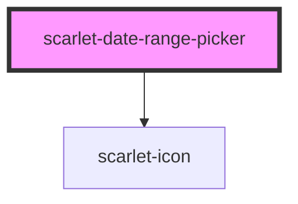

# scarlet-date-range-picker

<!-- Auto Generated Below -->

## Overview

Two `DD/MM/AAAA` fields (start/end) sharing one calendar popover for
picking both ends of a range — built the same way `scarlet-date-picker`
is (same masking/validation per field, same popover mechanics), doubled.
See that component's own doc comment for the shared known limitations
(no Tab-out auto-close, no viewport flip).

Picking works the classic two-click way: the first day clicked becomes
the start (clearing any previous end); the second becomes the end and
closes the popover — unless it's *before* the start, in which case it
becomes the new start instead and the popover stays open for the end.

## Properties

| Property           | Attribute           | Description                                                            | Type                                   | Default          |
| ------------------ | ------------------- | ---------------------------------------------------------------------- | -------------------------------------- | ---------------- |
| `disabled`         | `disabled`          | Disables both fields and the calendar toggle.                          | `boolean`                              | `false`          |
| `endPlaceholder`   | `end-placeholder`   | Placeholder for the end field.                                         | `"Data final"`                         | `'Data final'`   |
| `endValue`         | `end-value`         | End of the range, as `DD/MM/AAAA`.                                     | `string`                               | `''`             |
| `errorMessage`     | `error-message`     | Error message rendered below the fields.                               | `string \| undefined`                  | `undefined`      |
| `helperText`       | `helper-text`       | Helper text rendered below the fields. Hidden while an error is shown. | `string \| undefined`                  | `undefined`      |
| `invalid`          | `invalid`           | Marks the fields as invalid, independent of `errorMessage`.            | `boolean`                              | `false`          |
| `label`            | `label`             | Visible label rendered above both fields.                              | `string \| undefined`                  | `undefined`      |
| `max`              | `max`               | Latest selectable date, as `DD/MM/AAAA`.                               | `string \| undefined`                  | `undefined`      |
| `min`              | `min`               | Earliest selectable date, as `DD/MM/AAAA`.                             | `string \| undefined`                  | `undefined`      |
| `required`         | `required`          | Marks the fields as required in a parent form.                         | `boolean`                              | `false`          |
| `size`             | `size`              | Size of the fields.                                                    | `"lg" \| "md" \| "sm" \| "xl" \| "xs"` | `'md'`           |
| `startPlaceholder` | `start-placeholder` | Placeholder for the start field.                                       | `"Data inicial"`                       | `'Data inicial'` |
| `startValue`       | `start-value`       | Start of the range, as `DD/MM/AAAA`.                                   | `string`                               | `''`             |

## Events

| Event           | Description                                                                                           | Type                                  |
| --------------- | ----------------------------------------------------------------------------------------------------- | ------------------------------------- |
| `scarletChange` | Emitted whenever either bound changes — a keystroke, a day pick, or a blur-triggered mask correction. | `CustomEvent<ScarletDateRangeChange>` |
| `scarletHide`   | Emitted after the popover closes.                                                                     | `CustomEvent<void>`                   |
| `scarletShow`   | Emitted after the popover opens.                                                                      | `CustomEvent<void>`                   |

## Methods

### `hide() => Promise<void>`

Closes the calendar popover.

#### Returns

Type: `Promise<void>`

### `setFocus() => Promise<void>`

Focuses the start field.

#### Returns

Type: `Promise<void>`

### `show() => Promise<void>`

Opens the calendar popover.

#### Returns

Type: `Promise<void>`

## Dependencies

### Depends on

- [scarlet-icon](../../foundation/scarlet-icon)

### Graph

----------------------------------------------

*Built with [StencilJS](https://stenciljs.com/)*
