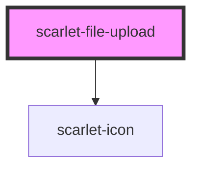

# scarlet-file-upload

<!-- Auto Generated Below -->

## Overview

A drag-and-drop file picker, backed by a real (visually hidden) native
`<input type="file">` — so it's a real form control and works with no JS
at all for the "click to browse" path; only the drag-and-drop layer is
enhancement on top.

## Properties

| Property       | Attribute        | Description                                                                                  | Type                  | Default     |
| -------------- | ---------------- | -------------------------------------------------------------------------------------------- | --------------------- | ----------- |
| `accept`       | `accept`         | Native `accept` attribute, e.g. `"image/*"` or `".pdf,.docx"`.                               | `string \| undefined` | `undefined` |
| `disabled`     | `disabled`       | Disables the dropzone and the native input.                                                  | `boolean`             | `false`     |
| `errorMessage` | `error-message`  | Error message rendered below the dropzone. Takes priority over the automatic max-size error. | `string \| undefined` | `undefined` |
| `helperText`   | `helper-text`    | Helper text rendered below the dropzone. Hidden while an error is shown.                     | `string \| undefined` | `undefined` |
| `label`        | `label`          | Visible label rendered above the dropzone.                                                   | `string \| undefined` | `undefined` |
| `maxSizeBytes` | `max-size-bytes` | Rejects any file over this size, showing a default error message instead of accepting it.    | `number \| undefined` | `undefined` |
| `multiple`     | `multiple`       | Allows more than one file.                                                                   | `boolean`             | `false`     |

## Events

| Event           | Description                                                                                      | Type                  |
| --------------- | ------------------------------------------------------------------------------------------------ | --------------------- |
| `scarletChange` | Emitted with the full current file list whenever it changes — a selection, a drop, or a removal. | `CustomEvent<File[]>` |

## Methods

### `clear() => Promise<void>`

Clears every selected file.

#### Returns

Type: `Promise<void>`

## Dependencies

### Depends on

- [scarlet-icon](../../foundation/scarlet-icon)

### Graph

----------------------------------------------

*Built with [StencilJS](https://stenciljs.com/)*
