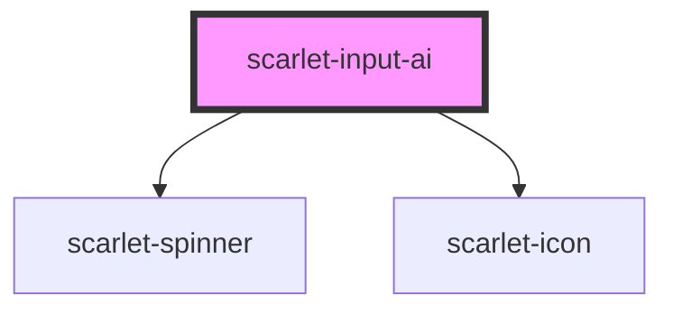

# scarlet-input-ai

<!-- Auto Generated Below -->

## Overview

A single-line text input with a "melhorar texto" button that hands the
current value off to an AI provider for a rewrite suggestion, then lets
the user apply or discard it — nothing replaces the value on its own.

This component never calls any AI provider itself: embedding a provider
API key in a design system that ships to a browser bundle would leak it
to every consuming app's users. `improve` is a plain async function,
set as a JS property (like `scarlet-table`'s `formatCell`, not parseable
from an HTML attribute) — wire it to your own backend endpoint, which is
the one that actually holds the API key and calls the provider. Leaving
`improve` unset hides the button entirely; the input still works as a
plain field.

Flow: click → `improve(value, aiContext)` → while pending, the button
shows a spinner and the input stays editable. If the promise resolves to
text identical to the current value, a brief "already good" note shows
instead of a suggestion. Otherwise the suggestion appears in a preview
with Aplicar/Descartar — Aplicar replaces `value` and emits
`scarletChange`/`scarletImprove`; Descartar just dismisses it. Editing
the field while a suggestion/note is showing dismisses it (it no longer
describes the current text). A response that arrives after the value
changed, or after a newer `improve` call started, is silently dropped —
it's for a version of the text that's no longer current.

## Properties

| Property            | Attribute             | Description                                                                                                                                                                                                                                                                   | Type                                                                               | Default                                |
| ------------------- | --------------------- | ----------------------------------------------------------------------------------------------------------------------------------------------------------------------------------------------------------------------------------------------------------------------------- | ---------------------------------------------------------------------------------- | -------------------------------------- |
| `aiContext`         | `ai-context`          | Passed as `improve`'s second argument, alongside the current value — whatever the rewrite needs to know about where this text is used.                                                                                                                                        | `string \| undefined`                                                              | `undefined`                            |
| `applyLabel`        | `apply-label`         | Label for the button that replaces the value with the suggestion.                                                                                                                                                                                                             | `"Aplicar"`                                                                        | `'Aplicar'`                            |
| `disabled`          | `disabled`            | Disables the field and the improve button.                                                                                                                                                                                                                                    | `boolean`                                                                          | `false`                                |
| `discardLabel`      | `discard-label`       | Label for the button that dismisses the suggestion, keeping the current value.                                                                                                                                                                                                | `"Descartar"`                                                                      | `'Descartar'`                          |
| `errorMessage`      | `error-message`       | Error message rendered below the field. Implies the invalid state.                                                                                                                                                                                                            | `string \| undefined`                                                              | `undefined`                            |
| `helperText`        | `helper-text`         | Helper text rendered below the field. Hidden while `errorMessage` is set.                                                                                                                                                                                                     | `string \| undefined`                                                              | `undefined`                            |
| `improve`           | --                    | Called with the current value (and `aiContext`, if set) when the improve button is clicked. Must resolve with the suggested replacement text. Set as a JS property — see the class doc comment for why this can't call an AI provider directly. Omitting it hides the button. | `((value: string, context?: string \| undefined) => Promise<string>) \| undefined` | `undefined`                            |
| `improveErrorLabel` | `improve-error-label` | Shown briefly when `improve` rejects.                                                                                                                                                                                                                                         | `"Não foi possível melhorar o texto."`                                             | `'Não foi possível melhorar o texto.'` |
| `improveLabel`      | `improve-label`       | Accessible label for the improve button.                                                                                                                                                                                                                                      | `"Melhorar texto"`                                                                 | `'Melhorar texto'`                     |
| `invalid`           | `invalid`             | Marks the field as invalid, independent of `errorMessage`.                                                                                                                                                                                                                    | `boolean`                                                                          | `false`                                |
| `label`             | `label`               | Visible label rendered above the field.                                                                                                                                                                                                                                       | `string \| undefined`                                                              | `undefined`                            |
| `maxlength`         | `maxlength`           | Maximum number of characters allowed.                                                                                                                                                                                                                                         | `number \| undefined`                                                              | `undefined`                            |
| `name`              | `name`                | Name submitted with a parent form.                                                                                                                                                                                                                                            | `string \| undefined`                                                              | `undefined`                            |
| `placeholder`       | `placeholder`         | Placeholder text shown when the field is empty.                                                                                                                                                                                                                               | `string \| undefined`                                                              | `undefined`                            |
| `readonly`          | `readonly`            | Makes the field read-only (the improve button stays usable — rewriting isn't editing the field directly until Aplicar).                                                                                                                                                       | `boolean`                                                                          | `false`                                |
| `required`          | `required`            | Marks the field as required in a parent form.                                                                                                                                                                                                                                 | `boolean`                                                                          | `false`                                |
| `resetAfter`        | `reset-after`         | How long the "already good"/error note stays before reverting to idle, in milliseconds.                                                                                                                                                                                       | `4000`                                                                             | `4000`                                 |
| `sameLabel`         | `same-label`          | Shown briefly when the suggestion comes back identical to the current value.                                                                                                                                                                                                  | `"Já está bom 👍"`                                                                 | `'Já está bom 👍'`                     |
| `size`              | `size`                | Size of the field.                                                                                                                                                                                                                                                            | `"lg" \| "md" \| "sm" \| "xl" \| "xs"`                                             | `'md'`                                 |
| `value`             | `value`               | Current value of the field.                                                                                                                                                                                                                                                   | `string`                                                                           | `''`                                   |

## Events

| Event                 | Description                                                                                                                                          | Type                      |
| --------------------- | ---------------------------------------------------------------------------------------------------------------------------------------------------- | ------------------------- |
| `scarletBlur`         | Emitted when the field loses focus.                                                                                                                  | `CustomEvent<FocusEvent>` |
| `scarletChange`       | Emitted when the field loses focus after its value has changed, and right after a suggestion is applied.                                             | `CustomEvent<string>`     |
| `scarletFocus`        | Emitted when the field gains focus.                                                                                                                  | `CustomEvent<FocusEvent>` |
| `scarletImprove`      | Emitted with the new value right after a suggestion is applied (alongside `scarletChange`) — listen here specifically to react to an AI-driven edit. | `CustomEvent<string>`     |
| `scarletImproveError` | Emitted with the error thrown/rejected by `improve`.                                                                                                 | `CustomEvent<Error>`      |
| `scarletInput`        | Emitted on every keystroke with the current value.                                                                                                   | `CustomEvent<string>`     |

## Methods

### `setFocus() => Promise<void>`

Focuses the internal input element.

#### Returns

Type: `Promise<void>`

## Dependencies

### Depends on

- [scarlet-spinner](../../feedback/scarlet-spinner)
- [scarlet-icon](../../foundation/scarlet-icon)

### Graph

----------------------------------------------

*Built with [StencilJS](https://stenciljs.com/)*
