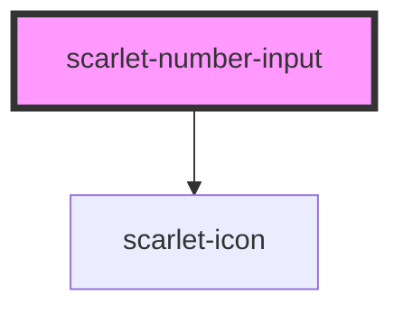

# scarlet-number-input

<!-- Auto Generated Below -->

## Overview

A numeric input with decrement/increment buttons — for a quantity field,
not a general-purpose text field that happens to hold numbers (that's
`scarlet-input type="number"`). Stays within `min`/`max` on every path:
the buttons, typing, and blur all clamp.

## Properties

| Property       | Attribute       | Description                                                           | Type                                   | Default     |
| -------------- | --------------- | --------------------------------------------------------------------- | -------------------------------------- | ----------- |
| `disabled`     | `disabled`      | Disables the field and both buttons.                                  | `boolean`                              | `false`     |
| `errorMessage` | `error-message` | Error message rendered below the field. Implies the invalid state.    | `string \| undefined`                  | `undefined` |
| `helperText`   | `helper-text`   | Helper text rendered below the field. Hidden while an error is shown. | `string \| undefined`                  | `undefined` |
| `invalid`      | `invalid`       | Marks the field as invalid, independent of `errorMessage`.            | `boolean`                              | `false`     |
| `label`        | `label`         | Visible label rendered above the field.                               | `string \| undefined`                  | `undefined` |
| `max`          | `max`           | Upper bound. Omit for no maximum.                                     | `number \| undefined`                  | `undefined` |
| `min`          | `min`           | Lower bound. Omit for no minimum.                                     | `number \| undefined`                  | `undefined` |
| `name`         | `name`          | Name submitted with a parent form.                                    | `string \| undefined`                  | `undefined` |
| `required`     | `required`      | Marks the field as required in a parent form.                         | `boolean`                              | `false`     |
| `size`         | `size`          | Size of the field.                                                    | `"lg" \| "md" \| "sm" \| "xl" \| "xs"` | `'md'`      |
| `step`         | `step`          | Amount each +/- click changes the value by.                           | `1`                                    | `1`         |
| `value`        | `value`         | Current value.                                                        | `number`                               | `0`         |

## Events

| Event           | Description                                                                                                   | Type                  |
| --------------- | ------------------------------------------------------------------------------------------------------------- | --------------------- |
| `scarletChange` | Emitted when the value is committed — a +/- click, or the field losing focus — always clamped to `min`/`max`. | `CustomEvent<number>` |
| `scarletInput`  | Emitted on every keystroke, with the raw (not yet clamped) numeric value.                                     | `CustomEvent<number>` |

## Methods

### `setFocus() => Promise<void>`

Focuses the internal input element.

#### Returns

Type: `Promise<void>`

## Dependencies

### Depends on

- [scarlet-icon](../../foundation/scarlet-icon)

### Graph

----------------------------------------------

*Built with [StencilJS](https://stenciljs.com/)*
