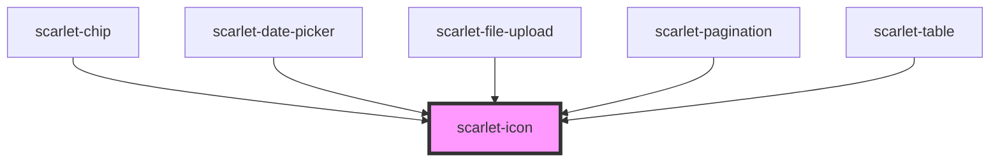

# scarlet-icon

<!-- Auto Generated Below -->

## Overview

Renders an icon from the design system's shared built-in set. Icons are
stroke-based and inherit `color`/`font-size` from their context, so they
line up with surrounding text and other components by default.

## Properties

| Property | Attribute | Description                                                                                                | Type                                                                                                                                                                                                                                                                                                                                                                                                                                                                                                                | Default     |
| -------- | --------- | ---------------------------------------------------------------------------------------------------------- | ------------------------------------------------------------------------------------------------------------------------------------------------------------------------------------------------------------------------------------------------------------------------------------------------------------------------------------------------------------------------------------------------------------------------------------------------------------------------------------------------------------------- | ----------- |
| `label`  | `label`   | Accessible label. Omit for a purely decorative icon (the default) — it is then hidden from assistive tech. | `string \| undefined`                                                                                                                                                                                                                                                                                                                                                                                                                                                                                               | `undefined` |
| `name`   | `name`    | Name of the built-in icon to render.                                                                       | `"alert-circle" \| "alert-triangle" \| "arrow-down" \| "arrow-left" \| "arrow-right" \| "arrow-up" \| "calendar" \| "check" \| "check-circle" \| "chevron-down" \| "chevron-left" \| "chevron-right" \| "chevron-up" \| "clock" \| "external-link" \| "eye" \| "eye-off" \| "file" \| "heart" \| "info-circle" \| "lock" \| "mail" \| "minus" \| "more-horizontal" \| "more-vertical" \| "pencil" \| "plus" \| "search" \| "settings" \| "star" \| "trash" \| "upload" \| "user" \| "x" \| "x-circle" \| undefined` | `undefined` |
| `size`   | `size`    | Size of the icon, as any valid CSS length. Defaults to `1em`, so it scales with the surrounding font size. | `string \| undefined`                                                                                                                                                                                                                                                                                                                                                                                                                                                                                               | `undefined` |

## Slots

| Slot | Description                                                      |
| ---- | ---------------------------------------------------------------- |
|      | Custom SVG content, used when `name` is omitted or unrecognized. |

## Dependencies

### Used by

 - [scarlet-chip](../../data-display/scarlet-chip)
 - [scarlet-date-picker](../../form-masked/scarlet-date-picker)
 - [scarlet-file-upload](../../form/scarlet-file-upload)
 - [scarlet-pagination](../../navigation/scarlet-pagination)
 - [scarlet-table](../../data-display/scarlet-table)

### Graph

----------------------------------------------

*Built with [StencilJS](https://stenciljs.com/)*
