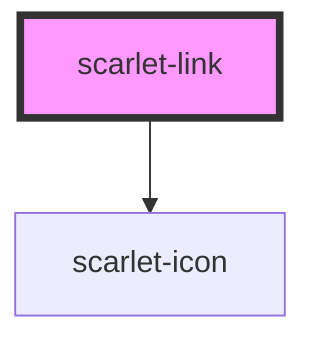

# scarlet-link

<!-- Auto Generated Below -->

## Overview

A styled inline text link — for a link inside a sentence/paragraph.
`scarlet-button variant="link"` is the button-semantics equivalent (an
action styled like a link); this is the reverse, a real `<a>` styled like
one. `target="_blank"` automatically gets `rel="noopener noreferrer"`
(unless `rel` is set explicitly) and a small external-link icon.

## Properties

| Property    | Attribute   | Description                                                                                | Type                                                                                   | Default     |
| ----------- | ----------- | ------------------------------------------------------------------------------------------ | -------------------------------------------------------------------------------------- | ----------- |
| `color`     | `color`     | Semantic color of the link.                                                                | `"error" \| "info" \| "neutral" \| "primary" \| "secondary" \| "success" \| "warning"` | `'primary'` |
| `disabled`  | `disabled`  | Renders as inert text — no `href`, `aria-disabled`.                                        | `boolean`                                                                              | `false`     |
| `href`      | `href`      | Native `href`. Omitting it (and setting `disabled`) renders inert text styled like a link. | `string \| undefined`                                                                  | `undefined` |
| `rel`       | `rel`       | Native `rel`. Defaults to `noopener noreferrer` when `target="_blank"`.                    | `string \| undefined`                                                                  | `undefined` |
| `target`    | `target`    | Native `target`, e.g. `_blank`.                                                            | `string \| undefined`                                                                  | `undefined` |
| `underline` | `underline` | When the underline shows.                                                                  | `"always" \| "hover" \| "none"`                                                        | `'hover'`   |

## Slots

| Slot | Description      |
| ---- | ---------------- |
|      | The link's text. |

## Dependencies

### Depends on

- [scarlet-icon](../scarlet-icon)

### Graph

----------------------------------------------

*Built with [StencilJS](https://stenciljs.com/)*
