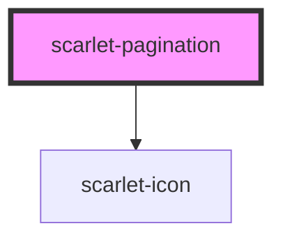

# scarlet-pagination

<!-- Auto Generated Below -->

## Overview

Page number navigation, following the WAI-ARIA pattern of a `<nav>`
landmark wrapping a list of buttons — the current page is a real button
(not a link, since this component doesn't own routing) marked
`aria-current="page"`. Collapses distant page numbers into an ellipsis
once `totalPages` is large, always keeping the first page, the last page,
and `siblingCount` pages on each side of the current one visible.

## Properties

| Property       | Attribute       | Description                                                                                        | Type          | Default       |
| -------------- | --------------- | -------------------------------------------------------------------------------------------------- | ------------- | ------------- |
| `ariaLabel`    | `aria-label`    | Accessible label for the `<nav>` landmark.                                                         | `"Paginação"` | `'Paginação'` |
| `page`         | `page`          | Current page (1-indexed).                                                                          | `number`      | `1`           |
| `siblingCount` | `sibling-count` | How many page numbers to show on each side of the current page before collapsing into an ellipsis. | `1`           | `1`           |
| `totalPages`   | `total-pages`   | Total number of pages.                                                                             | `1`           | `1`           |

## Events

| Event           | Description                                                                   | Type                  |
| --------------- | ----------------------------------------------------------------------------- | --------------------- |
| `scarletChange` | Emitted when the page changes via any control (a page number, prev, or next). | `CustomEvent<number>` |

## Dependencies

### Depends on

- [scarlet-icon](../../foundation/scarlet-icon)

### Graph

----------------------------------------------

*Built with [StencilJS](https://stenciljs.com/)*
